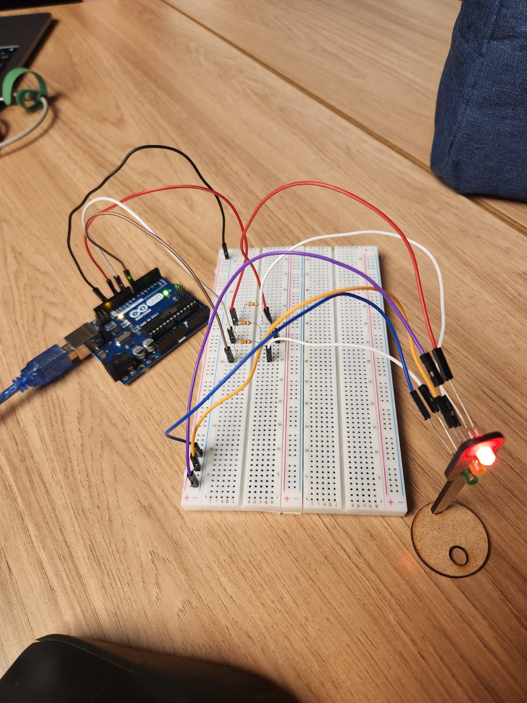

# Atividade do Semáforo
O objetivo deste projeto é desenvolver um semáforo offline utilizando LEDs e simulando o funcionamento real de um semáforo.

# Bill of materials
Os materiais utilizados durante o desenvolvimento deste prrojeto foram:

**Componentes** | **Quantidade utilizada** 
|----------|----------|
| LEDs | 3 |
| Resistores | 3 | 
| Arduino | 1 | 
| Protoboard |  1 | 
|  Jumpers macho-macho | 4 | 
|  Jumpers macho-fêmea |  6 | 

# Hardware


# Código

```C++
class SimpleLedSequencer {
public:
  SimpleLedSequencer() {}

  void init() {
    DDRB |= (1 << PB3) | (1 << PB1);
    DDRD |= (1 << PD7);
  }


  void runSequence() {
    PORTB |= (1 << PB3);   
    delay(6000);
    PORTB &= ~(1 << PB3);  
    
    PORTB |= (1 << PB1);   
    delay(2000);
    PORTB &= ~(1 << PB1);  
    
    PORTD |= (1 << PD7);   
    delay(4000);
    PORTD &= ~(1 << PD7);  
  }
};

SimpleLedSequencer meuSequenciador;


void setup() {
  meuSequenciador.init();
}

void loop() {
  meuSequenciador.runSequence();
}
```
O código utiliza a classe SimpleLedSequencer para organizar a lógica do semáforo.

No setup, a função init é chamada para configurar os pinos do Arduino (PB3/Pino 11, PB1/Pino 9 e PD7/Pino 7) como saídas.

No loop, a função runSequence é executada, criando a sequência do semáforo: ela acende o LED vermelho por 6 segundos, apaga; em seguida, acende o amarelo por 2 segundos, apaga; e, por fim, acende o verde por 4 segundos e apaga. Esse ciclo se repete em loop.

# Video
Link do Video: [Clique aqui](https://youtube.com/shorts/nrvEAICiETE?feature=share)
